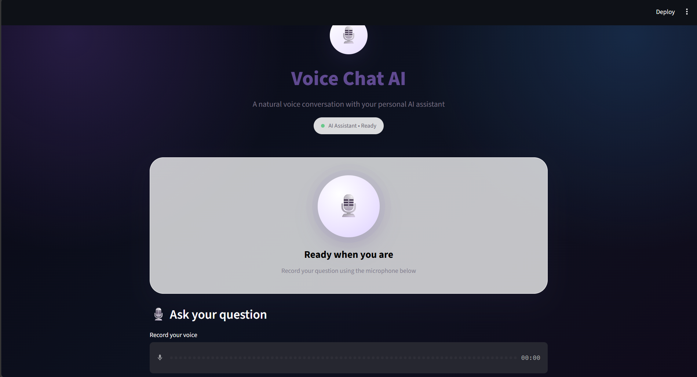

\# 🎙️ Voice Chat AI


A voice-based AI chatbot built with \*\*Streamlit\*\*, \*\*Speech Recognition\*\*, \*\*Ollama\*\*, and \*\*pyttsx3\*\*.


The application allows users to speak naturally with an AI assistant using their microphone and receive both text and voice responses.


\## ✨ Features


\- 🎙️ Voice input

\- 📝 Speech-to-text conversion

\- 🤖 AI responses using Ollama

\- 🧠 Llama 3.2 local AI model

\- 🔊 Text-to-speech AI responses

\- ⏹️ Stop AI response

\- 🔇 Stop AI voice

\- 🗑️ Clear conversation

\- 💬 Clean chat interface

\- 🌙 Dark/premium UI


\## 🛠️ Technologies Used


\- Python

\- Streamlit

\- Ollama

\- Llama 3.2

\- SpeechRecognition

\- pyttsx3


\## 📁 Project Structure


```text

VoiceChatAI/

│

├── app.py

├── requirements.txt

├── README.md

└── .gitignore

\## 📸 Application Preview

